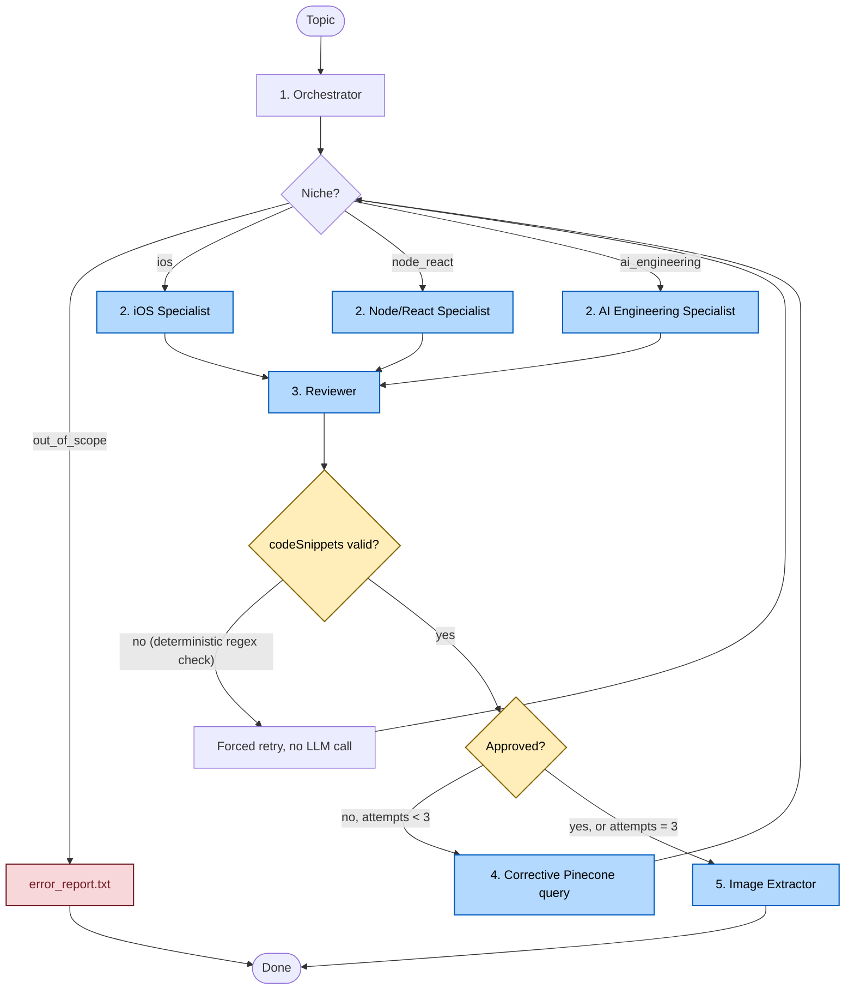

# 🚀 LangGraph Critic-RAG Builder

[](https://www.typescriptlang.org/)
[](https://github.com/langchain-ai/langgraphjs)
[](https://www.pinecone.io/)
[](https://deepmind.google/technologies/gemini/)
[](https://openrouter.ai/)
[](https://smith.langchain.com/)
[](.github/workflows/ci-release.yml)
[](.github/workflows/codeql.yml)
[](.github/dependabot.yml)
[](.gitleaks.toml)
[](.github/workflows/socket.yml)
[](.github/workflows/ci-release.yml)

A multi-agent content pipeline built on **LangGraph**, **Pinecone RAG**, and **OpenRouter**, that generates factually-grounded technical LinkedIn posts. A niche-classifying Orchestrator routes each request to a domain specialist; a strict fact-checking Reviewer runs an iterative correction loop against the draft (including the raw code, not just the surrounding prose) before anything is considered final; and an Image Extractor renders code snippets as syntax-highlighted PNGs via the Carbonara API.

The system never publishes anything on its own. It's **Human-in-the-Loop by design** — LinkedIn's API only allows creating posts as immediately `PUBLISHED`, with no draft state, so auto-posting isn't an option even if you wanted it. Every run produces a package (local files, or a JSON job + downloadable images over HTTP) that a human reviews and posts manually.

---

## 🗺️ Architectural Workflow

Cyclic state machine on `@langchain/langgraph`, with a hard cap of **3 review attempts** (`MAX_REVIEW_ATTEMPTS` in `src/graph/nodes/edgeConditions.ts`) before the pipeline gives up and emits whatever it has, clearly flagged as unverified.



---

## 🛠️ Pipeline Deep Dive

### 1. Orchestrator (`orchestratorNode.ts`)
Classifies the topic into `ios`, `node_react`, `ai_engineering`, or `out_of_scope`. Off-topic requests (recipes, general chat) short-circuit straight to the Image Extractor, which writes `output/<slug>/error_report.txt` instead of burning a specialist + reviewer cycle. Also produces a filesystem-safe folder slug (≤20 chars, prevents `ENAMETOOLONG`).

### 2. Specialists (`flutterNode.ts` → exports `createIosNode`, `nodeJsReactNode.ts`, `aiNode.ts`)
Each specialist has its own persona, grounding rules, and anti-hallucination instructions (never invent APIs/versions, prefer vague phrasing over guessing). Two grounding sources feed the prompt:
- **Live web data** — if the topic contains a URL, it's fetched and injected as `[WEB_DATA]`, treated as ground truth that overrides the model's training data.
- **Pinecone RAG** — `ragService.retrieveContext(query, niche)` pulls the top-4 chunks filtered by niche namespace.

### 3. Reviewer (`reviewerNode.ts`)
Two layers of validation, in order:
1. **Deterministic code-snippet guard** (no LLM call): a regex checks whether any `codeSnippets[i]` is empty or literally the unfilled `[CODE_SNIPPET_N]` placeholder — a real failure mode where the specialist echoes the token instead of writing code. Caught this way, it's free and 100% reliable; caught only by an LLM reviewer, it isn't.
2. **LLM fact-check**: reviews the draft prose **and** the actual raw code (not just the `[CODE_SNIPPET_N]` placeholder text) for fabricated APIs, wrong version claims, and non-compiling syntax. On rejection it returns surgical `corrections` (exact wrong text → fix) plus `approvedContent` (everything correct, preserved verbatim) so the specialist's next attempt is a targeted patch, not a full rewrite.

If a topic postdates the reviewer's training cutoff but is confirmed by `[WEB_DATA]`, the reviewer is instructed to trust the source over its own priors — this stops it from rejecting real, recent APIs as "hallucinated."

### 4. Iterative RAG
On rejection, the reviewer emits a targeted follow-up query (e.g. `"Swift withTimeout API standard library"`). The specialist re-queries Pinecone with that query *in addition to* the original one before its next attempt, rather than relying on the same static context that produced the wrong draft in the first place.

### 5. Image Extractor
Writes the final (or best-effort) post + code files to `output/<slug>/`, and renders each code snippet as a themed PNG via the Carbonara API. Also returns the images as base64 in graph state (`codeImages`) for callers that can't rely on the local filesystem persisting — namely the HTTP server on Railway's ephemeral containers.

---

## 🌐 Two Ways to Run It

### A. CLI (local, synchronous, writes to `output/`)
```bash
npm start -- "Explain how Swift async/await works, with code examples"
```
Note the `--` — without it, npm swallows the argument instead of forwarding it to the script. Omit the topic entirely and it runs a default iOS example.

### B. HTTP server (`src/server.ts`, deployed on Railway)
A plain Express wrapper — **not** LangGraph's official Agent Server (`langgraph dev`/`langgraph build`), which needs Redis, Postgres, and a paid LangSmith license for something this project doesn't need (threads, runs, Studio). Just a topic in, a job out.

**Async by design**: a full run (review retries + Carbonara rendering) can take 1–3+ minutes. That's long enough for some proxy or corporate firewall between the caller and Railway to kill an idle-looking connection before a synchronous response returns — Railway itself tolerates up to 15 minutes, but not every hop in between does. So `POST /generate` returns immediately with a `jobId`, and the caller polls for the result. Jobs live in memory (fine for a single replica; would need Redis/Postgres to scale to multiple instances).

**Images served separately from the JSON**: a single snippet PNG can be 100KB+, and base64-inflates by ~33% inside a JSON body — large enough that some networks mangle or truncate the response (this happened in practice). So `/result/:jobId` returns an image `url` per snippet, and a dedicated binary endpoint serves the actual PNG bytes.

```bash
# Kick off a generation
curl -X POST https://<your-app>.up.railway.app/generate \
  -H "Content-Type: application/json" \
  -H "x-api-key: $SERVER_API_KEY" \
  -d '{"topic": "Explain how Swift async/await works, with code examples"}'
# -> { "jobId": "...", "statusUrl": "/result/..." }

# Poll (repeat until status is "done" or "error")
curl -H "x-api-key: $SERVER_API_KEY" \
  https://<your-app>.up.railway.app/result/<jobId>

# Download a rendered code image
curl -H "x-api-key: $SERVER_API_KEY" \
  https://<your-app>.up.railway.app/result/<jobId>/images/snippet_1.png \
  -o snippet_1.png
```

| Endpoint | Method | Purpose |
|---|---|---|
| `/health` | GET | Liveness check (Railway healthcheck target) |
| `/generate` | POST | Body `{ "topic": string }` → `202 { jobId, statusUrl }` |
| `/result/:jobId` | GET | Job status/result JSON (`pending`/`running`/`done`/`error`) |
| `/result/:jobId/images/:filename` | GET | Raw PNG bytes for one rendered snippet |

All endpoints except `/health` require an `x-api-key` header matching `SERVER_API_KEY` (unset = unprotected, fine for local dev, never for a public deploy).

---

## 🧠 RAG: Keeping Pinecone Populated

`src/scripts/ingest.ts` populates the `posts-content` namespace from a curated URL list (`src/scripts/sources.json`, one array per niche):

```bash
npm run ingest                  # ingest everything in sources.json
npm run ingest -- --niche=ios   # one niche only
npm run ingest -- --force       # bypass the skip-if-unchanged cache
```

What it handles automatically:
- **Listing-page expansion**: a GitHub `tree/` URL is expanded via the GitHub Contents API into individual raw `.md` files (capped at 40, newest-first for numerically-prefixed names like Swift Evolution proposals) instead of being scraped as a near-empty JS-rendered page. Any other URL that returns suspiciously thin content (< 500 chars — a sign it's an index/nav page) gets scanned for same-origin child links one path segment deeper, and those are ingested instead.
- **Idempotent, deterministic chunk IDs** (SHA-256 of `source#chunkIndex`): re-running never duplicates vectors, and shrinking a source deletes its now-orphaned old chunks.
- **Skip-if-unchanged manifest** (`src/scripts/.ingest-manifest.json`): a content hash per source means re-running only pays the embedding cost for sources that actually changed.
- **Rate-limit-aware retries**: Gemini's free-tier embedding quota is a *rolling 60s TPM window*, so a short backoff just re-fails immediately — on a detected rate limit, the script waits out the full window (~65s) instead of a few seconds.

---

## 📊 Observability & Evaluation (LangSmith)

Every graph run is traced end-to-end when `LANGSMITH_TRACING=true` is set — Orchestrator → specialist → Reviewer loop → Image Extractor, with the exact prompt/response/token count/latency per node, viewable at [smith.langchain.com](https://smith.langchain.com).

Beyond tracing, there's a small regression-test dataset:

```bash
npm run eval:setup   # creates/updates the "linkedin-post-generator-niches" dataset (5 reference topics)
npm run eval          # runs the real graph against it, scores each run, logs a new experiment
```

`run-eval.ts` scores every run with **deterministic evaluators** (no LLM-as-judge, so results are reproducible and free of extra token cost):

| Evaluator | Checks |
|---|---|
| `niche_correct` | Did the Orchestrator classify the topic as expected? |
| `approved` | Did the post get approved within the review-attempt limit? (skipped for `out_of_scope`) |
| `code_snippets_valid` | When code is expected, is it real — not an empty/placeholder-echoed snippet? |
| `review_attempts` | Informational — how many review cycles it took (watch for this creeping up over time) |

This actually runs the full pipeline (real LLM + embedding calls, same cost as `/generate`), so the dataset is intentionally small and `maxConcurrency` is kept at 1. With only 5 examples, treat single-run swings as noise, not a trend — it's best used to catch hard regressions (a metric silently going to 0) between changes, not to measure fine-grained quality drift yet.

---

## 🛡️ Resilience

- **OpenRouter model fallback + retry**: `qwen/qwen3-coder-next` is the primary model (`src/config.ts`); if it's rate-limited or errors, OpenRouter automatically routes to `nvidia/nemotron-3.5-lightning:free` then `liquid/lfm-2.5-2.6b:free`. On top of that, `openrouterService.ts` retries the call itself up to 3 times with exponential backoff (2s/4s/8s) on 429/500/502/503.
- **RAG degrades gracefully**: if Pinecone or the Gemini embedding API is unavailable, `ragService.ts` catches the error, logs it, and returns empty context instead of crashing the graph — the specialist still produces a draft, just without retrieval grounding for that call.
- **In-memory embedding cache** (15min TTL, capped at 200 entries): repeated identical queries (common during manual testing and `npm run eval`, which re-runs the same fixed topics) skip the Gemini embedding call entirely on a cache hit.
- **Async job queue** on the HTTP server sidesteps the "long-running request gets killed by an intermediate proxy" failure mode entirely, rather than trying to extend timeouts.

---

## 🎛️ Technology Stack

- **LangGraph** (`@langchain/langgraph`) — cyclic multi-agent state machine, Zod-validated state schema
- **TypeScript / Node.js** (≥24.10) via `tsx`
- **Pinecone** (serverless) — vector store, namespace `posts-content`
- **Google Generative AI Embeddings** — `models/gemini-embedding-001` (3072-dim), used identically for ingestion and query time so they stay comparable
- **OpenRouter** — LLM gateway with model-array fallback; primary model `qwen/qwen3-coder-next`, `langchain`'s `createAgent` + `providerStrategy` for Zod-schema structured outputs
- **Express** — HTTP wrapper for deployment (`src/server.ts`)
- **LangSmith** (`langsmith` SDK) — tracing + dataset-based evaluation
- **Carbonara API** — code-to-PNG rendering

---

## 📂 Output Package Structure (CLI mode)

```bash
output/ios-swiftui/
├── linkedin_post.txt    # Post text + hashtags (or a ⚠️ WARNING-prefixed draft if the review limit was hit unapproved)
├── snippet_1.swift      # Compilable source (extension depends on niche: .swift / .ts / .py)
├── snippet_1.png        # Rendered code image (Dracula theme, Mac window frame)
└── error_report.txt     # Written instead of the above if the topic was out_of_scope or hit a critical failure
```

The HTTP server returns the equivalent data as JSON + image URLs instead of writing to disk (see the endpoint table above) — Railway's filesystem is ephemeral, so nothing under `output/` there survives a redeploy.

---

## 🚀 Setup & Installation

### Prerequisites
- Node.js ≥ 24.10
- A Pinecone serverless index (3072 dimensions, cosine metric) — see the RAG section above for populating it
- An OpenRouter API key
- A Gemini API key (used only for embeddings, not generation)

### Environment Configuration
Copy `.env.example` to `.env` and fill in the values:

```env
OPENROUTER_API_KEY=
OPENROUTER_HTTP_REFERER=http://localhost:3000
OPENROUTER_X_TITLE=

PINECONE_API_KEY=
PINECONE_INDEX_NAME=
GEMINI_API_KEY=
GEMINI_MODEL=models/gemini-embedding-001   # must be an embedding model, not gemini-2.5-flash etc.

# Optional — HTTP server auth (required for a public deploy)
SERVER_API_KEY=

# Optional — LangSmith tracing + eval
LANGSMITH_TRACING=true
LANGSMITH_ENDPOINT=https://api.smith.langchain.com
LANGSMITH_API_KEY=
LANGSMITH_PROJECT=
```

### Install & Verify
```bash
npm install
npm test          # unit tests: orchestrator classification, edge-condition routing
npx tsc --noEmit   # typecheck
```

### Run
```bash
npm start -- "Explain how Swift async/await works, with code examples"   # CLI, writes to output/
npm run server:dev                                                        # HTTP server, local
npm run server                                                            # HTTP server, prod (no --env-file, expects env vars from the platform)
```

### npm Scripts Reference

| Script | Purpose |
|---|---|
| `npm start -- "<topic>"` | Run one generation via CLI, writes to `output/` |
| `npm run server:dev` | HTTP server, local (`.env` loaded) |
| `npm run server` | HTTP server, production (env vars from platform) |
| `npm run ingest [-- --niche=X \| --force]` | Populate/update the Pinecone RAG index |
| `npm run eval:setup` | Create/update the LangSmith eval dataset |
| `npm run eval` | Run the graph against the eval dataset, score it |
| `npm test` / `npm run test:watch` | Unit tests |
